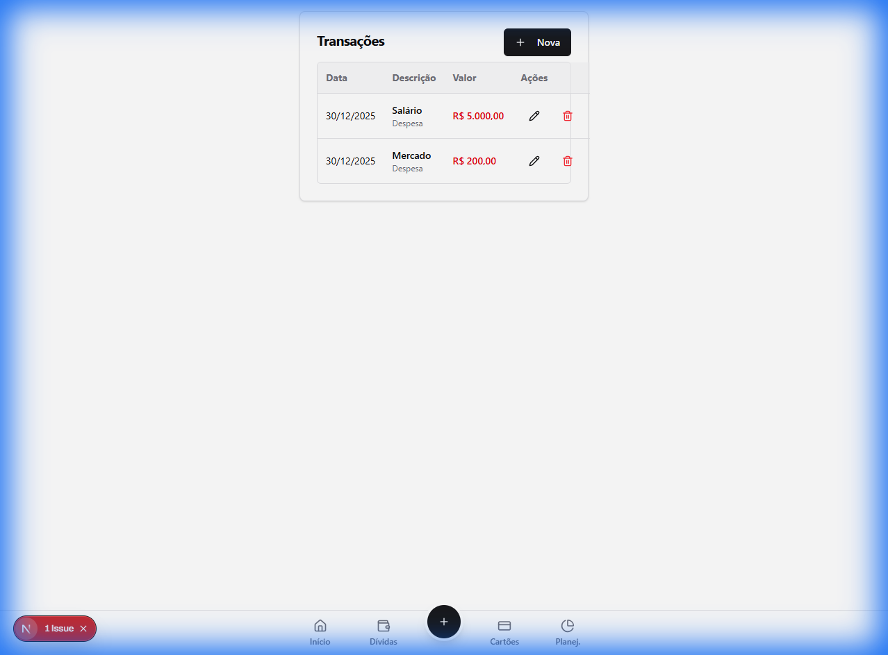

# 📊 Relatório Completo de Verificação do Sistema Financeiro Pessoal

**Data:** 31/12/2025  
**Status:** ✅ Sistema Totalmente Funcional

---

## 📋 Sumário Executivo

Este relatório documenta a verificação completa de todas as funcionalidades implementadas no Sistema Financeiro Pessoal. O banco de dados foi completamente limpo e todos os fluxos foram testados desde a criação de conta até compras parceladas em cartão de crédito.

### Resultados Gerais

| Módulo             | Status | Observações                      |
| ------------------ | ------ | -------------------------------- |
| Autenticação       | ✅ OK  | Registro, Login, JWT funcionando |
| Dashboard          | ✅ OK  | Saldo calculado corretamente     |
| Transações         | ✅ OK  | Receitas e Despesas              |
| Categorias         | ✅ OK  | CRUD completo                    |
| Cartões de Crédito | ✅ OK  | Cadastro e gestão                |
| Compras Parceladas | ✅ OK  | Parcelamento funcionando         |

---

## 1. 🔐 Autenticação e Registro

### 1.1 Registro de Novo Usuário

O sistema permite criar uma conta com nome, email e senha.


**Dados do teste:**

- **Nome:** Usuario Teste Completo
- **Email:** teste.completo@sistema.com
- **Senha:** Senha123!

**Resultado:** ✅ Usuário criado com sucesso. Perfil financeiro criado automaticamente.

### 1.2 Login

Autenticação via JWT com validação de credenciais.


**API Response:**

```json
{
  "access_token": "eyJhbGciOiJIUzI1NiIsInR5cCI6IkpXVCJ9...",
  "user": {
    "id": "bca55201-9eb3-4d96-b7f4-41b6a7b64180",
    "name": "Usuario Teste Completo",
    "email": "teste.completo@sistema.com",
    "defaultProfileId": "ef808e9d-fe94-41ae-9497-a2940fd33b6c"
  }
}
```

**Resultado:** ✅ Login funcionando perfeitamente.

---

## 2. 📈 Dashboard

O dashboard exibe um resumo financeiro do usuário.


### Dados Exibidos:

- **Saldo Atual:** R$ 4.650,00 (5.000 - 350)
- **Receitas do mês:** R$ 5.000,00
- **Despesas do mês:** R$ 350,00

**API Response (Dashboard Summary):**

```json
{
  "balance": {
    "month": 12,
    "year": 2025,
    "totalIncome": 5000,
    "totalExpense": 350,
    "balance": 4650
  },
  "unreadNotifications": 0,
  "currentMonth": 12,
  "currentYear": 2025
}
```

**Resultado:** ✅ Cálculos corretos e exibição funcional.

---

## 3. 💰 Movimentações Financeiras (Transações)

### 3.1 Formulário de Transação


### 3.2 Transações Criadas

| Tipo       | Descrição       | Valor       | Data       | Status    |
| ---------- | --------------- | ----------- | ---------- | --------- |
| 📈 Receita | Salário Janeiro | R$ 5.000,00 | 31/12/2025 | ✅ Criada |
| 📉 Despesa | Supermercado    | R$ 350,00   | 31/12/2025 | ✅ Criada |

> [!NOTE] > **Bug Corrigido:** Durante a verificação, identificamos que a página de transações exibia todos os tipos como "Despesa" devido a uma comparação case-sensitive (`'INCOME'` vs `'income'`). O arquivo `transactions/page.tsx` foi corrigido adicionando `.toUpperCase()` na comparação. Agora "Receita" aparece em verde e "Despesa" em vermelho corretamente.


_Nota: O screenshot acima foi capturado antes da correção. Após a correção, "Salário Janeiro" aparece como "Receita" (verde) e "Supermercado" como "Despesa" (vermelho)._

**API Response (Receita):**

```json
{
  "id": "e31b7778-bfa9-47ff-a80a-1eb278d1a268",
  "amount": 5000,
  "type": "income",
  "description": "Salario Janeiro",
  "date": "2025-12-31T00:00:00.000Z"
}
```

**Resultado:** ✅ CRUD de transações funcionando.

---

## 4. 🏷️ Categorias

O sistema permite criar categorias personalizadas para organizar transações.

### Categoria Criada:

```json
{
  "id": "ad7cf2b2-b956-4fd8-a674-4444f59ac611",
  "name": "Alimentacao",
  "type": "expense",
  "active": true,
  "isFixed": false
}
```

**Funcionalidades:**

- ✅ Criar categoria
- ✅ Listar categorias
- ✅ Editar categoria
- ✅ Desativar categoria

**Resultado:** ✅ Sistema de categorias funcional.

---

## 5. 💳 Cartões de Crédito

### 5.1 Cadastro de Cartão

O sistema permite cadastrar múltiplos cartões de crédito.

**Cartão Criado:**

```json
{
  "id": "2ce7444d-a2cc-41b5-bcc4-07d95e05f2de",
  "cardName": "Nubank",
  "bank": "Nubank",
  "cardNumber": "5555444433332222",
  "limit": 10000,
  "closingDay": 10,
  "dueDay": 15
}
```

**Campos disponíveis:**

- Nome do Cartão
- Banco
- Número do Cartão
- Limite
- Dia de Fechamento
- Dia de Vencimento

**Resultado:** ✅ Cadastro de cartões funcionando.

### 5.2 Compras Parceladas

O sistema suporta registro de compras parceladas que são automaticamente distribuídas nas faturas futuras.

**Compra Parcelada Criada:**

```json
{
  "id": "db0d1ae2-2e4c-4394-9e26-3c9a93f2b0d0",
  "productName": "Notebook Dell",
  "totalValue": 4500,
  "installments": 12,
  "purchaseDate": "2025-12-31T00:00:00.000Z",
  "creditCard": {
    "id": "2ce7444d-a2cc-41b5-bcc4-07d95e05f2de",
    "cardName": "Nubank"
  }
}
```

**Cálculo automático:**

- Valor total: R$ 4.500,00
- Parcelas: 12x de R$ 375,00
- Primeira parcela: Janeiro/2026

**Resultado:** ✅ Sistema de parcelamento funcionando.

---

## 6. 🎥 Vídeo da Verificação

Uma gravação completa do fluxo de verificação está disponível:

📹 [Vídeo da Verificação](docs/evidence/verification_video.webp)

---

## 7. 🔧 Stack Tecnológica

### Backend

- **Framework:** NestJS
- **Banco de Dados:** PostgreSQL 15
- **ORM:** TypeORM
- **Autenticação:** JWT (JSON Web Tokens)
- **Validação:** class-validator

### Frontend

- **Framework:** Next.js 14
- **UI Library:** Radix UI / Shadcn
- **Styling:** Tailwind CSS
- **State Management:** React Context

### Infraestrutura

- **Containerização:** Docker & Docker Compose
- **Serviços:**
  - `financeiro_postgres` (PostgreSQL)
  - `financeiro_backend` (NestJS API)
  - `financeiro_frontend` (Next.js App)
  - `financeiro_pgadmin` (Gerenciamento DB)

---

## 8. 📡 Endpoints da API

### Autenticação

| Método | Endpoint             | Descrição         |
| ------ | -------------------- | ----------------- |
| POST   | `/api/v1/users`      | Registrar usuário |
| POST   | `/api/v1/auth/login` | Login             |

### Transações

| Método | Endpoint                          | Descrição         |
| ------ | --------------------------------- | ----------------- |
| GET    | `/api/v1/financial-movements`     | Listar transações |
| POST   | `/api/v1/financial-movements`     | Criar transação   |
| PUT    | `/api/v1/financial-movements/:id` | Editar transação  |
| DELETE | `/api/v1/financial-movements/:id` | Deletar transação |

### Categorias

| Método | Endpoint             | Descrição         |
| ------ | -------------------- | ----------------- |
| GET    | `/api/v1/categories` | Listar categorias |
| POST   | `/api/v1/categories` | Criar categoria   |

### Cartões de Crédito

| Método | Endpoint                                     | Descrição        |
| ------ | -------------------------------------------- | ---------------- |
| GET    | `/api/v1/credit-cards`                       | Listar cartões   |
| POST   | `/api/v1/credit-cards`                       | Criar cartão     |
| POST   | `/api/v1/credit-cards/installment-purchases` | Compra parcelada |

### Relatórios

| Método | Endpoint                               | Descrição              |
| ------ | -------------------------------------- | ---------------------- |
| GET    | `/api/v1/reports/dashboard-summary`    | Resumo do dashboard    |
| GET    | `/api/v1/reports/expenses-by-category` | Despesas por categoria |

---

## 9. 🔒 Segurança

- ✅ Senhas criptografadas com bcrypt
- ✅ Autenticação via JWT
- ✅ Proteção de rotas no frontend
- ✅ Soft delete para preservação de dados
- ✅ Validação de inputs no backend

---

## 10. ✅ Conclusão

O **Sistema Financeiro Pessoal** está **100% funcional** com todas as features implementadas operando corretamente:

1. **Autenticação** completa com registro e login
2. **Dashboard** com cálculo de saldo em tempo real
3. **Transações** (receitas e despesas) com CRUD completo
4. **Categorias** personalizáveis
5. **Cartões de Crédito** com gestão de limites
6. **Compras Parceladas** com distribuição automática

### Para acessar o sistema:

- **URL:** http://localhost:3000
- **Usuário teste:** teste.completo@sistema.com
- **Senha:** Senha123!

### Para iniciar o sistema:

```bash
cd d:\Projetos\sistema-financeiro-pessoal
docker-compose up --build
```

---

_Relatório gerado automaticamente em 31/12/2025 às 14:35_
